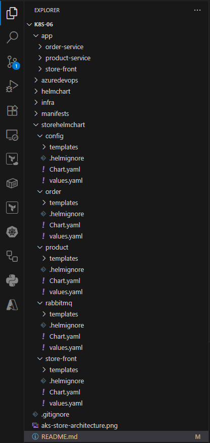

# Part 19: Deploying microservice applications in AKS using Helm Chat and Azure Pipeline(Dynamically update the image tag in values.yaml)

    Part1:   Manual Deployment (AzCLI + Docker Desktop + kubectl)  
    GitHub:  https://github.com/santosh-gh/k8s-01
    YouTube: https://youtu.be/zoJ7MMPVqFY

    Part2:   Automated Deployment (AzCLI + Docker + kubect + Azure Pipeline)
    GitHub:  https://github.com/santosh-gh/k8s-02
    YouTube: https://youtu.be/nnomaZVHg9I

    Part3:   Automated Infra Deployment (Bicep + Azure Pipeline)
    GitHub:  https://github.com/santosh-gh/k8s-03
    YouTube: https://www.youtube.com/watch?v=5PAdDPHn8F8

    Part4:   Manual Deployment (AzCLI + Docker Desktop + Helm charts + kubectl) 
    GitHub:  https://github.com/santosh-gh/k8s-04
    YouTube: https://www.youtube.com/watch?v=VAiR3sNavh0

    Part5:   Automated Deployment (AzCLI + Docker + Helm charts + kubectl + Azure Pipeline) 
    GitHub:  https://github.com/santosh-gh/k8s-04
    YouTube: https://www.youtube.com/watch?v=MnWe2KGRrxg&t=883s

    Part6:   Automated Deployment (AzCLI + Docker + Helm charts + kubectl + Azure Pipeline) 
             Dynamically update the image tag in values.yaml
    GitHub:  https://github.com/santosh-gh/k8s-06
    YouTube: https://www.youtube.com/watch?v=Nx0defm8T6g&t=11s

    Part7:   Automated Deployment (AzCLI + Docker + Helm charts + kubectl + Azure Pipeline)
             Store the helm chart in ACR
             Dynamically update the image tag in values.yaml
             Dynamically update the Chart version in Chart.yaml

    GitHub:  https://github.com/santosh-gh/k8s-07
    YouTube: https://www.youtube.com/watch?v=Y3RaxSZNTaU&t=1s

    Part8:   Automated Deployment (AzCLI + Docker + Helm charts + kubectl + Azure Pipeline)
             Store the helm chart in ACR
             Dynamically update the image tag in values.yaml
             Dynamically update the Chart version in Chart.yaml
             Deploy into multiple environments (dev, test, prod) with approval gates

    GitHub:  https://github.com/santosh-gh/k8s-08
    YouTube: https://www.youtube.com/watch?v=oNysAAGijGk&t=43s

    Part9:   Manual Deployment (AzCLI + Docker + kustomize + kubectl)          
             Deploy into multiple environments (dev, test, prod) through command line

    GitHub:  https://github.com/santosh-gh/k8s-09
    YouTube: https://www.youtube.com/watch?v=Jtz1KldOPAA&t=1s

    Part10:  Automated Deployment (AzCLI + Docker + kustomize + kubectl + Azure Pipeline)          
             Deploy into multiple environments (dev, test, prod) through automated pipeline

    GitHub:  https://github.com/santosh-gh/k8s-10
    YouTube: https://www.youtube.com/watch?v=m5ZXmOk0IBs&t=43s

# Architesture

    # Store front: Web application for customers to view products and place orders.
    # Product service: Shows product information.
    # Order service: Places orders.
    # RabbitMQ: Message queue for an order queue.

# Directory Structure

# Tetechnology Stack

    Azure Pipelines
    Infra (AzCLI/Bicep)
    AKS
    ACR
    HelmChart
    Argo CD

# Steps

    1. Infra deployment using AzCLI/Bicep command line 
       OR 
       Pipelines azcli-infra-pipeline.yml/bicep-infra-pipeline.yml

       Infra deployment using AzCLI command line

        a. Login to Azure

            az login
            az account set --subscription=<subscriptionId>
            az account show

        b. Show existing resources

            az resource list

        c. Create RG, ACR and AKS

            # AzCLI
            ./infra/azcli/script.sh

            OR

            # Bicep
            az deployment sub create --location uksouth --template-file ./infra/bicep/main.bicep --parameters ./infra/bicep/main.bicepparam

        d. Connect to cluster

            RESOURCE_GROUP="rg-onlinestore-dev-uksouth-001"
            AKS_NAME="aks-onlinestore-dev-uksouth-001"
            az aks get-credentials --resource-group $RESOURCE_GROUP --name $AKS_NAME --overwrite-existing           

        e. Short name for kubectl

            alias k=kubectl

        d. Show all existing objects

            k get all

    2. Install and Access Argo CD

        a. Create namespace for Argo CD

            kubectl create namespace argocd

        b. Install Argo CD

            kubectl apply -n argocd -f https://raw.githubusercontent.com/argoproj/argo-cd/stable/manifests/install.yaml

        c. Expose Argo CD API server

            kubectl port-forward svc/argocd-server -n argocd 8080:443

        d. Get initial admin password

            kubectl get secret argocd-initial-admin-secret -n argocd \
              -o jsonpath="{.data.password}" | base64 -d; echo

        e. Browse and Login

            https://localhost:8080/

        f. Login to Argo CD from command line

            argocd login localhost:8080 --username admin --password 9ySYEhIbhV8VB8Av --insecure    
        
        g. Add Git Repository to Argo CD

            argocd repo add https://github.com/santosh-gh/k8s-19-deployment.git \
            --username santosh-gh \
            --password GitHub@2025 --insecure-skip-server-verification

            argocd repo add https://github.com/santosh-gh/k8s-19-deployment.git

    2. Run CI Pipelines

            config.yml
            rabbitmq.yml
            order-pipeline.yml
            product-pipeline.yml
            store-front-pipeline.yml

        a. Build and push images to ACR
           
        b. Upadate image tag with Build Id

        c. Update Helm values.yaml in GitOps repository (k8s-19-deployment) 
           
           Argo CD will pull the images from ACR and deploy into AKS

    5. Validate and Access the application

    6. Clean the Azure resources

# Verify the Deployment

    k get pods
    k get services
    curl <LoadBalancer public IP>:80
    Browse the app using http://<LoadBalancer public IP>:80

# Clean the Azure resources

    az group delete --name rg-onlinestore-dev-uksouth-001 --yes --no-wait